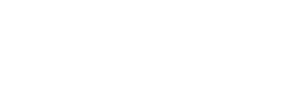

# Relógio Digital 
 


Este é um projeto desenvolvido com HTML, CSS e JavaScript para criar um relógio digital básico. O objetivo deste projeto é demonstrar como criar um relógio simples usando tecnologias web.


## Instalação/Como usar

<p align="center">
<a href="https://analeopoldino.github.io/RelogioDigital/" align="center"></a>
</p>
<br>
<br>

<p align="center"><i> Se preferir abra uma nova guia do seu navegador e copeie e cole o link abaixo.</i></p>

<p align="center">

```
LINK: https://analeopoldino.github.io/RelogioDigital/
```
</p>
<br>


## Funcionalidades


* Exibição do horário atual em formato digital em horas, minutos e segundos.
* Relógio atualizado em tempo real.


## Contribuição

Se você encontrar algum problema ou tiver sugestões de melhorias, fique à vontade para abrir uma "issue" ou enviar um "pull request". Sua contribuição é muito bem-vinda!


## Referência

Este projeto foi desenvolvido com base em um vídeo tutorial do canal "Larissa Kich" no YouTube. O vídeo que utilizei como referência pode ser encontrado [aqui](https://youtu.be/GK0ok3ZCXwM).

Agradeço ao canal **Larissa Kich** pela excelente explicação e orientação que me ajudaram a criar este Relógio Digital.

---


Obrigado por visitar o site! Espero que ele possa servir como um guia útil para o desenvolvimento de projetos mais complexos no futuro.😊

